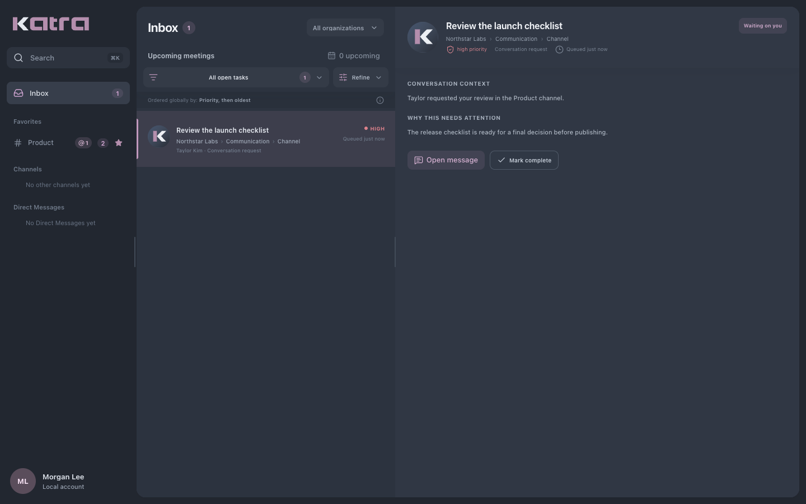
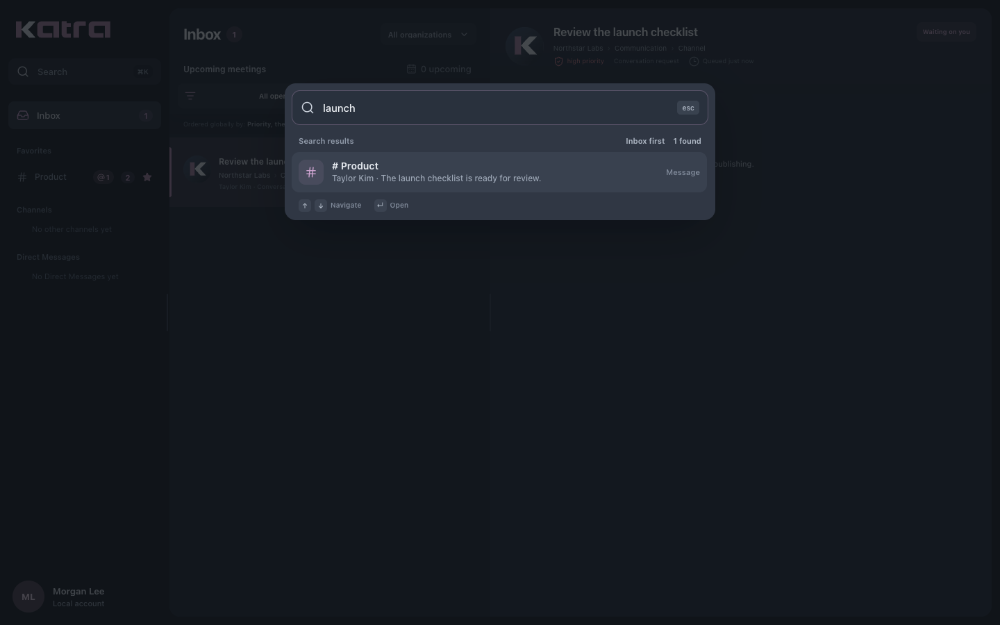

# Katra

Katra is an open-source, self-hosted workspace for team communication and meetings. Projects, workflows, and agent coordination are under active development and are not enabled in the current application.

Katra is developed by [DevOption](https://devoption.io).

## Documentation

Installation, configuration, and user documentation are available at [katra.io/docs](https://katra.io/docs/).

## Screenshots





## Local development

The supported development environment uses Docker Compose:

```sh
docker compose up --build
```

The client is available at `http://localhost:5173`, the API at `http://localhost:8000`, and Mailpit at `http://localhost:8025`.

The local stack uses development-only credentials and binds its published ports to the local machine. Do not use the Compose configuration as a production deployment.

## Repository layout

- `client/` contains the Vue and TypeScript application.
- `server/` contains the Laravel API and realtime services.
- `compose.yaml` defines the local development stack.

## Contributing and support

Bug reports and focused pull requests are welcome. See [CONTRIBUTING.md](CONTRIBUTING.md) before submitting a change.

For product support or help running Katra, visit [devoption.io](https://devoption.io).

## License

Katra is released under the [MIT License](LICENSE).
